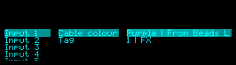
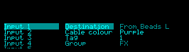
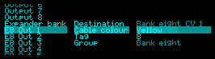
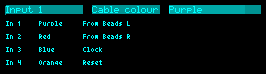

# Development contract

## Source and scope

Started from Substrate spec `d4abe223-d4c5-4784-811b-417aa43586ee`,
**Disting NT physical connection map and Helper companion interface**.
The owner authorized development on 2026-09-27 and named the as-built baseline
**V1** on 2026-09-28. [v1-spec.md](v1-spec.md) records the current scope and
remaining acceptance work, including lifecycle acceptance. The original
brainstorming capture remains in source-spec.md. V1 is not a production tag.

The live workflow now includes preset serialization, SD companion loading/cache,
automatic field reconciliation, the table/minimap, native colour/tag pages,
and dynamic page updates. See the V1 spec for measured hardware evidence.

## Verified API findings

The official [distingNT_API](https://github.com/expertsleepersltd/distingNT_API)
is pinned at `9aeda6d41484815b80416b903a564510da6026cd` (API v13).
`_NT_factory` exposes `serialise`, `deserialise`, and `parameterString`.
The last callback supplies display text, as demonstrated by `examples/gain.cpp`.
The firmware's `0x53` Set string parameter value message reaches the plug-in's
`midiSysEx` callback: a handler can store the text and return it through
`parameterString` when `0x50` requests the value. This was verified on hardware
on 2026-09-28. It does not call `parameterChanged` on the diagnostic plug-in.
Preset callbacks support custom state, and `midiSysEx` also provides the custom
USB transport specified in [live-map-protocol.md](live-map-protocol.md).

Helper has a built-in algorithm string-write path. Its bundled Lua controllers
are pure projections of immutable slot snapshots and currently expose numeric
controls. The remaining native-editor issue is the property type conversion:
declaring SDK unit `18` produced firmware-reported unit `0` in the probe,
while the built-in Mixer reports `18` for its editable channel name.
See [native-text-investigation.md](native-text-investigation.md) for the
reproducer and the distinction between working string transport and unresolved
native editor access.

## Prototype decisions

- Provisional algorithm GUID: `ThPh`. No collision found in the inspected local
  plugin sources or Helper algorithm metadata. Check the community index before
  first release; preserve the GUID after release.
- Custom slot member: `patch_helper`, version 1. See the shared fixture.
- Twenty native sockets, IDs 0–11 for inputs 1–12, 12–19 for outputs 1–8.
  The array must contain each ID exactly once, in any input order. Writers
  normalize it into socket order. No auxiliary bus is a physical socket.
- Required map fields: `version`, `title`, `connections`. Required connection
  fields: `socket`, `destination`, `colour`, `tag`, `group`.
- Colour IDs 0–11: None, Black, White, Grey, Red, Orange, Yellow, Green, Blue,
  Purple, Pink, Brown. Tag 0 means absent; 1–12 are the optional visible tags.
- New destination, group and expander-name edits accept 32 printable ASCII
  characters. Group/name buffers are 33 bytes including the terminator.
  Destination/title storage remains 64 bytes to preserve preview presets.
  An unchanged long destination may accompany edits to other fields; replacing
  it requires at most 32 characters. Both implementations reject unsupported
  input without truncation.
- Empty destination means unused; metadata remains intact. Groups are stored
  without providing grouping UI yet. The palette and retention policy remain
  reviewable development defaults, not owner-approved spec decisions.
- Missing custom state initializes a default map. Malformed present state,
  unknown versions/fields, and duplicate sockets fail closed. Decode into a
  candidate first, so failure cannot partially replace a valid map. Unrelated
  firmware-owned slot properties are skipped/preserved.
- All persistent state is per-instance SRAM requested from the host. Audio
  processing is an empty callback. No global mutable map, routing parameters,
  filesystem I/O, or audio-thread allocation exists.

## Build and verification

Requirements: ARM GCC, Python 3, a C++17 native compiler, and nlohmann/json
headers for native tests only (`brew install nlohmann-json`, or your platform
equivalent). No JSON library is linked into the ARM object.

```sh
git submodule update --init
python3 -m pip install -r tools/requirements-arm-smoke.txt
make verify
# Override only when headers are outside the compiler's normal search path:
make test JSON_INCLUDE=/custom/include
```

Native tests use AddressSanitizer/UndefinedBehaviorSanitizer and a desktop
adapter for the firmware JSON cursor API. They exercise the actual factory
callbacks, malformed-state rejection and atomicity, fixture round trips,
socket identity, display bounds, and unchanged audio/CV buffers. The adapter
does not prove firmware parser or physical preset lifecycle behavior.

`make inspect` verifies ELF32 little-endian ARM relocatable output, exported
`pluginEntry`, and an allowlist of runtime and pinned API imports. Section
sizes and demangled imports are printed for review. `step` projects native
controls when needed and never reads or writes the audio/CV buffer.
Deserialization uses the instance-owned scratch map, not a whole map on stack.

`make arm-smoke` runs the built ARM object under Unicorn with strict data
alignment checks, explicit host-function stubs, halfword-aligned parameter
storage, and both zeroed and poisoned instance memory. It runs at two code/data
address layouts and rejects instance reads/writes beyond the declared SRAM size,
including accesses performed by stubbed `memcpy` and `memset`. It exercises construction,
initial parameter callbacks, the first `step`, and `draw`. This is not an NT
firmware/ELF-loader emulator and does not replace hardware acceptance.

The 2026-09-27 build-flags audit compared the skill's `templates/Makefile` and
pinned API `examples/Makefile`: Cortex-M7, FPv5-D16 hard float, Thumb, `-Os`,
`-fPIC`, no RTTI/exceptions, function/data sections, and no unwind tables.
C++17 is required by our source; a single compilation unit produces the
relocatable object directly with `-c`, matching the upstream example approach.
`-mno-unaligned-access` is an additional hardware safeguard: the earlier object
failed the ARM startup test while reading its default title with an unaligned
word load. Makefile changes invalidate the hardware object to prevent stale
flags. The import allowlist is observed compatibility, not a complete firmware
export catalogue; the device reported `memcmp` as unavailable.

The follow-up allocation/PIC audit found no heap allocation in the ARM object.
`requirements()` declares the entire instance, including both maps and mutable
parameter definitions. Placement `new` initializes that host-supplied block;
it does not allocate from a heap. The hardware translation unit rejects builds
without `-fPIC`. A colour table previously had external inline linkage, producing
GOT relocations that the GNU linker in the smoke test resolved automatically.
The table now has internal linkage, retaining PIC while eliminating the GOT.
Object inspection rejects GOT dependencies and unexpected imports (including
heap allocators). The previous alignment build still crashed on the physical NT;
GOT elimination is a loader-compatibility hypothesis, not confirmed causation.

`make static-check` runs cppcheck. It suppresses only two warning categories
in the unmodified upstream headers: host-owned aggregate members without a
constructor, and the upstream private non-explicit JSON-stream constructor.
Plugin warnings remain errors. No production release is created by CI.

The fixture is also stored in nt_helper at
`test/fixtures/patch_map/native-map.json`. Keep both copies identical when the
format changes. Helper's `PatchMapPresetCodec` accepts one full slot object;
it validates GUID `ThPh` and preserves the rest of that slot on writes.
The direct placement of `patch_helper` in that slot is a provisional integration
contract. Confirm the firmware's actual custom-data envelope from an exported
device preset before wiring this codec into user-facing preset operations.
The native harness proves the callback payload, not that outer envelope.

## Remaining integration work

See [V1](v1-spec.md) for current acceptance boundaries. Native destination/group
text now uses separate greyed-out `parameterString()` properties. Eight expander
banks share one set of eight visible socket pages, selected on Expander bank;
colour/tag indices remain independent and the bank name is also displayed. The owner accepts display-only text pending
firmware/SDK support for native editing; no custom text editor is approved.
End-of-chain preset merging and preservation of pending field edits across
editor/app disposal remain open. Gear sorting/group presentation and arbitrary
GUID adapters are deferred. SD loading, caching, automatic field reconciliation,
and regular preset recall now have implementation and test/device evidence.
No production tag or Substrate readiness approval is implied by this baseline.

## Editor revision supersedes the initial-slice limitations

The SD-card host Lua requirement is implemented in this revision; see
[companion-contract.md](companion-contract.md). Native-only presets retain
version 1. Version 2 adds named expander objects and eight connection records
per instance. Moves preserve each bank's cable data. The map and deserialization
scratch space are per-instance host-allocated SRAM, about 27 KiB combined.
ARM stack inspection found deserialization at 48 bytes plus its bounded parser
calls (largest individual frame 320 bytes), not a full expanded map on stack.
The audio callback updates native page count and the legacy selector range when inventory
changes; it leaves all audio/CV buffers untouched. Older initial-slice notes
above describe revision 1 and must not be used to defer the Lua companion again.


## Owner hardware check, 2026-09-27

The owner confirmed that revision `275e282` loads, enables, and no longer
crashes the NT. Loading the companion then timed out in the plug-in handshake.
A direct SD download confirmed `/programs/helper/ThPh.lua` matched the repository
source exactly. The reply omitted `F0`; the native host stub had incorrectly
accepted that. Tests now require the opening delimiter and compare complete
wire frames. The corrected callback also accepts independently retained input
delimiters. Companion/map round-trip acceptance remains a separate check.


## Per-socket native pages

The native editor exposes four separate fields per socket: Destination, Cable
colour, Tag and Group. The two text fields are fixed-value, greyed-out string
properties. Twenty native socket pages remain permanent; an Expander bank page
selects one of eight banks for the following eight socket pages. This uses 231
parameters, with independent colour/tag indices for all 84 sockets. Old maps
beyond eight banks retain their data and an Other sockets compatibility page.
Mappings through bank eight retain their indices; older higher-bank mappings
need reassignment because their indices now hold text properties.

Definitions and page arrays are instance-owned SRAM reserved up front.
`NT_updateParameterPages()` notifies the host when inventory or bank selection
changes. Native and ARM startup tests cover callbacks, page indices, independent
rows, bank bounds, greyed-out strings and host notification.

## Connected-device verification, 2026-09-27

On v1.19.0beta (Sep 16 2026), controlled builds with identical instance storage
accepted 240 plug-in parameters and rejected 241, 242, 243, 247, 248, 249 and
251. The 251-parameter build was also rejected in an empty preset. Moving the
instance to DRAM did not resolve it. These are observed firmware limits, not a
guarantee for other firmware. At that stage the build used 235 parameters plus
the firmware Bypass parameter and new maps stopped at 12 banks; the existing 13-bank wire
and preset format is retained, with a selector/colour/tag compatibility page
for old maps. No records are silently truncated.

The final object loaded with the three existing built-in algorithms, restored
the saved cable colours, and ran with Bypass Off. Adding an NTX-8CV in the live
Helper editor changed the device's page response from 20 to 28 socket pages
(plus its standard Algorithm page) without reconstructing the algorithm.
Writing E1 Out 8 Tag = 7 and Cable colour = Blue through native parameter writes
updated the Lua-rendered row and minimap automatically. Editing its destination
in Helper appeared on the NT display without Apply. Native/ARM checks remain
separate from this physical-device evidence.

Saving and recalling `Patch Pages Test` retained the 28 socket pages, E1 Out 8
Blue/tag 7, and the original Input 1 Purple/tag 1. The test destination was
cleared before saving. End-of-chain preset merging remains unverified.

## Native text display verification (2026-09-28)

The deployed ARM object SHA-256 is
`83fdf3d1096e4db84b41ae9a4aedfc23412edd917791ffe5bb8795e4efd9f7c2`.
Its SD readback matched the local object byte for byte. After restoring
`Patch Pages Test`, native `0x50` reads returned `Purple | From Beads L`,
`1 | FX`, `Red | From Beads R`, `None | FX`, `Blue | Clock`,
`None | Timing`, `Blue | Clock FWD`, and `7 | Timing` for the matching
native and expander properties. The physical NT parameter screen showed both
formatted values on Input 1. This verifies display-only text, not native text
editing. The existing page count, colour/tag indices and numeric ranges remain.




## Eight-bank field pages and connected list (2026-09-28)

The production layout now has 231 plugin parameters plus Bypass. On the connected
NT, Input 1 displayed four separate properties. Loading an eight-bank test map,
selecting Bank 8, and reading the string properties returned `Bank eight CV 1`,
`Bank eight`, and expander name `NTX 8`. The parameter screen displayed E8 Out 1
with all four fields. This tests recorded banks, not eight attached expanders.
The working four-slot preset was restored afterward.




The following connected-list build was uploaded and read back byte for byte:
SHA-256 `4a9306eae18de7e7adf1cb637d9b8368ba3b41f523c8165e2858534bc52f6b02`.
The saved preset was backed up separately as `/presets/PH 0928 111756.json`
before upload, then restored as Patch Pages Test. The NT screen confirms the
native parameter row remains unobstructed above baselines 21, 34, 47 and 60.
The custom view claims only the right encoder and filters blank destinations.
Native callback tests cover scrolling over socket gaps, both bounds, insertion,
removal, empty maps, unchanged parameter values and unchanged map revision.
Physical right-encoder operation remains an owner acceptance check.



Checks passed: native ASan/UBSan tests, cppcheck, ARM imports/PIC inspection,
and construction/first draw at two emulated load addresses with strict alignment.
The matching Helper branch passed all 3924 tests and analysis without issues.
